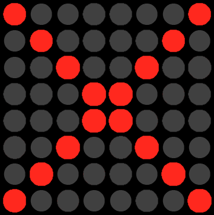
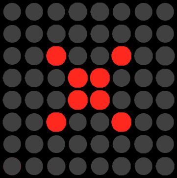

# DiscordMatrix

Displays your Discord connection status on a MAX7219 LED Matrix, connected via Arduino.

# Running the source code

To install the dependencies, run `pip install -r requirements.txt`. 

To start the application, simply run `python discord_matrix.pyw` from the command line.

# Current Legend

| Status | Icon  |
| ------ | :---- |
| Disconnected |  |
| Connected |  |
| Muted |   |
